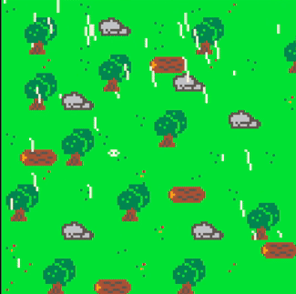

# PICO-8 rainlib
A small library that allows you to create and draw rain effects in PICO-8.



## Installation & Usage
All required code is included in the `rainlib_m.lua` file. Copy the code to one of your PICO-8 cart code tabs and integrate the code into your project. It should look something like this:

```lua
function _init()
    -- your code here --
    rainlib.init()
end

function _update()
    -- your code here --
    rainlib.update()
end

function _draw()
    -- your code here --
    rainlib.draw()
end
```

There two version of the rainlib in the project. One is the `rainlib.lua` which is the development version with more readable core. The second one is `rainlib_m.lua` which contains a compressed version of the `rainlib.lua`. Use the compressed version unless you want to do changes to the lib. It uses less tokes and characters for your game.

> The rain lib draw call should be the last one before UI elements or anything which should not be affected by the rain effects.

## Features

### Rain
The lib allows to set the intensity of the rain and the wind direction for the drops.

```lua
rainlib.intensity = 3 -- will spawn three rain drops per tick (default:1)
rainlib.direction = 1 -- will move every rain drop one pixel to the right per tick, -1 will move every rain drop to the left per tick (default:0)
```

### Puddles
The lib can also draw puddle splashes when the drop hits the ground.
```lua
rainlib.has_puddles = true -- default: true
```

### Thunder
You can show random lightning effects on top of the rain effects.
```lua
rainlib.has_thunder = true -- default: true
```

### Thunder

## Tools

### Aseprite
This project uses the [Aseprite](https://www.aseprite.org/) sprite editor for sprites.

*Workflow:*
1. Make changes to the `spritesheet.png` and save the file.
2. Import the changes in PICO-8 with `import spritesheet.png`
3. In case you want to export the spritesheet, use `export spritesheet.png` after making a change in the PICO-8 editor.

### Emulation
This library is for the [PICO-8](https://www.lexaloffle.com/pico-8.php) fantasy console.

### Development
The code is maintained with the [Visual Studio Code](https://code.visualstudio.com/) code editor. But any editor can be used.

*Workflow:*
1. Create a new PICO-8 cart and put the following code in:

    ```lua
    #include rainlib/main.lua
    #include rainlib/rainlib.lua
    ```

2. Edit the `.lua` files and simply run the PICO-8 emulator. The library will be loaded automatically. However, make sure to save the lua files.
3. Before commit changes update the compressed version (`rainlib_m.lua`) with a shrink tool like (Shrinko8)[https://thisismypassport.github.io/shrinko8/]
